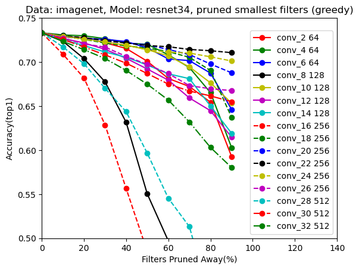
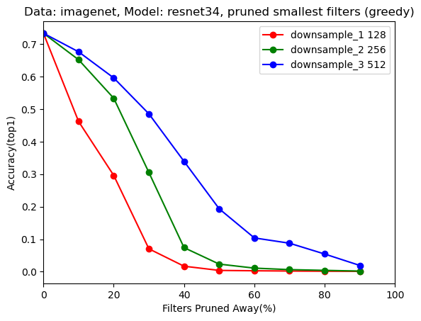

# implementation-of-pruning-filters
A reproduction of PRUNING FILTERS FOR EFFICIENT CONVNETS
## Arguments  
- -net: net type, default='resnet34'
- -dataset: dataset, default='imagenet'
- -b: batch size, default=256
- -lr: initial learning rate, default=0.1
- -e: epoch, default=90
- -optim: optimizer, default="SGD"
- -gpu: select GPU, default="0,1"
- -retrainflag: retrain or not, default=False
- -retrainepoch: retrain epoch, default=20
- -retrainlr: retrain learning rate, default=0.001
- -trainflag: train or not, default=False
- -pruneflag: prune or not, default=False
- -sortflag: sort filter by abs sum of weights or not, default=False
- -independentflag: pruning strategy, default=False
- -shortcutflag: prune the shortcut, default=True
- -prune_channels: the number of channels to prune corresponding to the prune_layers
- -prune_layers: the layers to prune
## Examples
__Tips:__ Please put your dataset in the _data_ folder or modify your path to dataset in _get_data.py_ before running the following code.  
  
### ResNet-34-pruned-B on ImageNet  
```
python train.py -pruneflag -retrainflag -prune_layers conv_4 conv_6 conv_10 conv_12 conv_18 conv_20 conv_22 conv_24 -prune_channels 32 32 77 77 102 102 102 102
```
### Analysis on pruning the the smallest filters in ResNet-34
```
python pruneAnalysis.py -pruneflag
```

### Analysis on pruning the the smallest filters (shorcut) in ResNet-34
```
python pruneAnalysis.py -pruneflag -shortcutflag
```

### Pretrain VGG-16 on cifar10
```
python train.py -net vgg16 -dataset cifar10 -b 128 -e 200
```

### VGG-16-pruned-A on cifar10
```
python train.py -net vgg16 -dataset cifar10 -b 128 -pruneflag -prune_layers conv_1 conv_8 conv_9 conv_10 conv_11 conv_12 conv_13 -prune_channels 32 256 256 256 256 256 256 -retrainflag -retrainepoch 40 -retrainlr 0.001
```

## Partial Results
model | params | FLOPs | best_top1 | best_top5 | inference time(ms)
:-------------------------:|:-------------------------:|:-------------------------:|:-------------------------:|:-------------------------:|:-------------------------
VGG-16 pretrained on CIFAR10 | 14.992M | 314.562M  | 93.630% | 99.670% | 0.12387054112005236
ResNet-34 (pretrained model on pytorch) | 21.798M | 3.672G  | 73.314% | 91.420% | 0.753
VGG-16-pruned-A on cifar10  | 5.400M | 207.102M  | 93.570% | 99.550% | 0.11985054855585098
ResNet-34 on ImageNet | 19.488M | 2.793G  | 72.374% | 90.974% | 0.6542
### VGG-16 ON CIFAR-10：
- filters ranked by abs sum of weights:  

- Prune the smallest filters:  

- Prune the smallest filters and retrain：

### ResNet-34 ON ImageNet
- Prune the smallest filters:  

- Prune the smallest filters(shortcut):  


## References
https://github.com/tyui592/Pruning_filters_for_efficient_convnets  
https://arxiv.org/abs/1608.08710  
https://arxiv.org/abs/1512.03385
